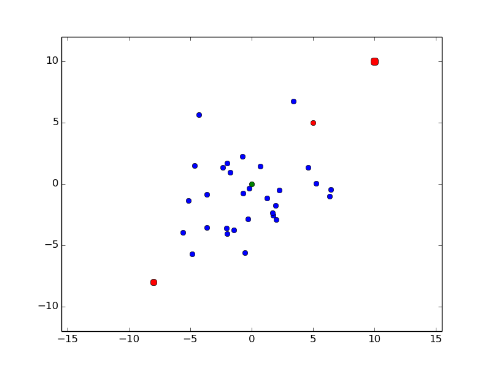
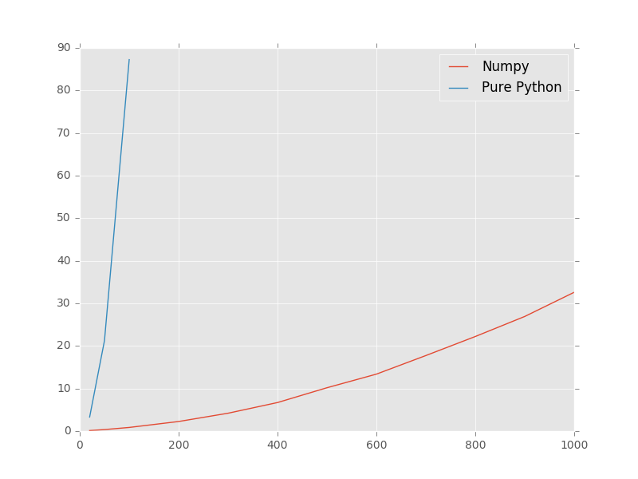

pylof
=====
[](https://travis-ci.org/damjankuznar/pylof)

Python implementation of Local Outlier Factor algorithm by [Markus M. Breunig](http://www.dbs.ifi.lmu.de/Publikationen/Papers/LOF.pdf).

Examples
--------

### Example 1

The following example illustrates the simple use case of computing LOF values of several instances (e.g. `[0,0],[5,5],[10,10] and [-8,-8]`) based on the `instances` variable that we pass to the `LOF` constructor.
```python
instances = [
 (-4.8447532242074978, -5.6869538132901658),
 (1.7265577109364076, -2.5446963280374302),
 (-1.9885982441038819, 1.705719643962865),
 (-1.999050026772494, -4.0367551415711844),
 (-2.0550860126898964, -3.6247409893236426),
 (-1.4456945632547327, -3.7669258809535102),
 (-4.6676062022635554, 1.4925324371089148),
 (-3.6526420667796877, -3.5582661345085662),
 (6.4551493172954029, -0.45434966683144573),
 (-0.56730591589443669, -5.5859532963153349),
 (-5.1400897823762239, -1.3359248994019064),
 (5.2586932439960243, 0.032431285797532586),
 (6.3610915734502838, -0.99059648246991894),
 (-0.31086913190231447, -2.8352818694180644),
 (1.2288582719783967, -1.1362795178325829),
 (-0.17986204466346614, -0.32813130288006365),
 (2.2532002509929216, -0.5142311840491649),
 (-0.75397166138399296, 2.2465141276038754),
 (1.9382517648161239, -1.7276112460593251),
 (1.6809250808549676, -2.3433636210337503),
 (0.68466572523884783, 1.4374914487477481),
 (2.0032364431791514, -2.9191062023123635),
 (-1.7565895138024741, 0.96995712544043267),
 (3.3809644295064505, 6.7497121359292684),
 (-4.2764152718650896, 5.6551328734397766),
 (-3.6347215445083019, -0.85149861984875741),
 (-5.6249411288060385, -3.9251965527768755),
 (4.6033708001912093, 1.3375110154658127),
 (-0.685421751407983, -0.73115552984211407),
 (-2.3744241805625044, 1.3443896265777866)]

from lof import LOF
lof = LOF(instances)

for instance in [[0,0],[5,5],[10,10],[-8,-8]]:
    value = lof.local_outlier_factor(5, instance)
    print value, instance
```
The output should be:
```
0.901765248682 [0, 0]
1.36792777562  [5, 5]
2.28926007995  [10, 10]
1.91195816119  [-8, -8]
```
This example is also visualized on the following figure, where blue dots
represent instances passed to LOF constructor, green dots are instances that
are not outliers (lof value <= 1) and red dots are instances that are outliers
(lof value > 1). The size or red dots represents the lof value, meaning that
greater lof values result in larger dots.


Code used for plotting the above plot (matplotlib is required):
```python
from matplotlib import pyplot as plt

plt.style.use('ggplot')

x,y = zip(*instances)
plt.scatter(x,y, 20, color="#0000FF")

for instance in [[0,0],[5,5],[10,10],[-8,-8]]:
    value = lof.local_outlier_factor(3, instance)
    color = "#FF0000" if value > 1 else "#00FF00"
    plt.scatter(instance[0], instance[1], color=color, s=(value-1)**2*10+20)
plt.show()
```

### Example 2
Pylof also has a helper function to identify outliers in a given instances dataset.
```python
instances = [
 (-4.8447532242074978, -5.6869538132901658),
 (1.7265577109364076, -2.5446963280374302),
 (-1.9885982441038819, 1.705719643962865),
 (-1.999050026772494, -4.0367551415711844),
 (-2.0550860126898964, -3.6247409893236426),
 (-1.4456945632547327, -3.7669258809535102),
 (-4.6676062022635554, 1.4925324371089148),
 (-3.6526420667796877, -3.5582661345085662),
 (6.4551493172954029, -0.45434966683144573),
 (-0.56730591589443669, -5.5859532963153349),
 (-5.1400897823762239, -1.3359248994019064),
 (5.2586932439960243, 0.032431285797532586),
 (6.3610915734502838, -0.99059648246991894),
 (-0.31086913190231447, -2.8352818694180644),
 (1.2288582719783967, -1.1362795178325829),
 (-0.17986204466346614, -0.32813130288006365),
 (2.2532002509929216, -0.5142311840491649),
 (-0.75397166138399296, 2.2465141276038754),
 (1.9382517648161239, -1.7276112460593251),
 (1.6809250808549676, -2.3433636210337503),
 (0.68466572523884783, 1.4374914487477481),
 (2.0032364431791514, -2.9191062023123635),
 (-1.7565895138024741, 0.96995712544043267),
 (3.3809644295064505, 6.7497121359292684),
 (-4.2764152718650896, 5.6551328734397766),
 (-3.6347215445083019, -0.85149861984875741),
 (-5.6249411288060385, -3.9251965527768755),
 (4.6033708001912093, 1.3375110154658127),
 (-0.685421751407983, -0.73115552984211407),
 (-2.3744241805625044, 1.3443896265777866)]

from lof import outliers
lof = outliers(5, instances)

for outlier in lof:
    print outlier["lof"],outlier["instance"]
```
The output should be:
```
2.20484969217 (3.3809644295064505, 6.749712135929268)
1.79484408482 (-4.27641527186509, 5.6551328734397766)
1.50121865848 (6.455149317295403, -0.45434966683144573)
1.47940253262 (6.361091573450284, -0.9905964824699189)
1.37216956549 (5.258693243996024, 0.032431285797532586)
1.29100195101 (4.603370800191209, 1.3375110154658127)
1.20274006333 (-4.844753224207498, -5.686953813290166)
1.18718018398 (-5.6249411288060385, -3.9251965527768755)
1.10898567816 (0.6846657252388478, 1.4374914487477481)
1.05728304007 (-4.667606202263555, 1.4925324371089148)
1.04216295935 (-5.140089782376224, -1.3359248994019064)
1.02801167935 (-0.5673059158944367, -5.585953296315335)
```
This example is also visualized on the following figure, where blue dots
represent instances passed to LOF constructor, green dots are instances that
are not outliers (lof value <= 1) and red dots are instances that are outliers
(lof value > 1). The size or red dots represents the lof value, meaning that
greater lof values result in larger dots.


Code used for plotting the above plot (matplotlib is required):
```python
from matplotlib import pyplot as plt

plt.style.use('ggplot')

x,y = zip(*instances)
plt.scatter(x,y, 20, color="#0000FF")

for outlier in lof:
    value = outlier["lof"]
    instance = outlier["instance"]
    color = "#FF0000" if value > 1 else "#00FF00"
    plt.scatter(instance[0], instance[1], color=color, s=(value-1)**2*10+20)

plt.show()
```

Performance
-----------
Currently there are two implementations of pylof. One that is implemented in
pure Python and one using Numpy to do most of the computations. Not
surprisingly, the Numpy implementation is much faster, however, both could be
further optimized (contributions welcomed). Bellow is a figure comparing the
two implementations with respect to the instance count and time consumed. The
number of instance features (dimensions) is constant - 10. The data set that
was used in these tests is available in `tests/dataset.csv` file. As can be seen
the pure Python implementation is plotted only for up to 100 instances, due to
the high computation time.


Code used for plotting the above plot (matplotlib is required):
```python
from matplotlib import pyplot as plt
import numpy as np

plt.style.use('ggplot')

# results of running performance.py script
perf_results = {"Numpy": np.array([[20.0, 0.1287980079650879],
                                   [50.0, 0.35866403579711914],
                                   [100.0, 0.8581411838531494],
                                   [200.0, 2.254122018814087],
                                   [300.0, 4.200999021530151],
                                   [400.0, 6.708652019500732],
                                   [500.0, 10.184601068496704],
                                   [600.0, 13.382768869400024],
                                   [700.0, 17.746567964553833],
                                   [800.0, 22.217625856399536],
                                   [900.0, 26.926273822784424],
                                   [1000.0, 32.60432696342468]]),
                "Pure Python": np.array([[20, 3.3015658855438232],
                                         [50, 21.251996994018555],
                                         [100, 87.25664114952087],
                                         [200, 453.45867109298706],
                                         [300, 1136.0742671489716]])}

for label, results in perf_results.items():
    print label
    print results
    plt.plot(results[:, 0], results[:, 1], label=label)

plt.xlabel("Number of instances")
plt.ylabel("Execution time [sec]")
plt.ylim([0, 200])
plt.legend()
plt.show()
plt.close()
```

TODO
-----
 * Increase the unit test coverage
